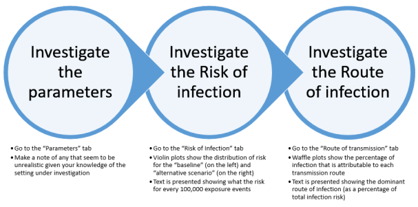

<br>

The steps for using CEMRA are split into four sections: setup, interpretation, tuning and reportable results.

##### **Step 1: Setup**


##### **Step 2: Interpretation**




##### **Step 3: Tuning** 


##### **Step 4: Reportable results**

To generate reportable results you will need to run with simulations of at least 20,000 (this will take more than 10 minutes). For this it is better to use the R package with the CSV that you created above. Download [R](https://www.r-project.org/) and [Rstudio](https://www.rstudio.com/) and run the following commands: 

````{r eval=FALSE}
install.packages("devtools")
library(devtools)
install_github("IOM-Research/CEMRA")
library(CEMRA)
results<-CEMRA::run_model("THECSVYOUCREATED.csv", 20000)
```


