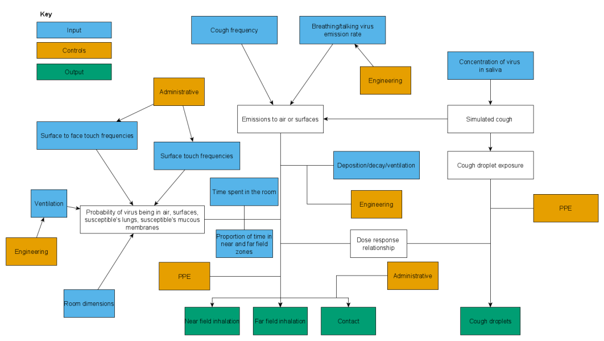

 

##### **Overview**

* CEMRA is a model and web application used to understand the risk of covid-19 infection from multiple routes in indoor settings. The original model was developed in 2020 [(Jones, 2020)](https://www.ncbi.nlm.nih.gov/research/coronavirus/publication/32643585).

* CEMRA uses a compartmental model of nine states (with 4 absorbing - i.e. virus cannot leave these states once it has been transported there) within a room to estimate virus transport and fate for contact and inhalation transmission, implemented using a discrete-time Markov chain. A transition matrix is created which represents the probability of the virus moving from one state to another. At each time step (0.001 minutes) the virus concentrations are updated; the transport of virus is ‘Memoryless’ - each change only depends only on the concentration in the time step before. Initial conditions are equated with steady state in a well mixed room. 

* The room is split up into a near-field (1 metres surrounding the infectious individual) and far field zones. In these areas the virus can be in the air and on surfaces.  

* Droplet transmission from coughing is based on respiratory droplet size distribution, extrapolated to the expiratory volume, with a probability of impacting the face in proportion to the surface area of the mucous membranes.

* The route of transmission is defined by particle size. The inhalation route is exhaled air with particles under 16 micron particles. Cough spray is particles over 100 microns that land on the mucous membranes (under 100 microns is inhaled). Cough spray over 16 microns lands on surfaces then can be transferred to mucous membranes by hand (with a probability assigned for virus that deposits to reach the respiratory tract - 0.001 to 0.1); cough spray under 16 microns lands on mucous membranes (with a probability assigned to the susceptible for intercepting a cough - 0.05). There is an assumption that virus concentrations are equally distributed by size of particle and there is no re-suspension of particles from surface to air.

* Deposition, decay and ventilation affect the amount of virus in the air, surfaces and the skin. .We assume that the dominant touch surface is plastic and there is a stable temperature, relative humidity and UV (i.e. environmental conditions don't affect decay rate). 

* Susceptible parameters include area of finger, face, eye and volume of face cone, time spent in the room, time spent in the far field and touches to surfaces and face. 

* Infectiousness has been defined by the viral load in saliva, viral emission during breathing and coughing parameters in the model. We have developed a simple “Infected Status” in the app from extremely low to extremely high, where we have assumed that all three parameters increase linearly along this scale (within the distributions that have been published in the literature). There is an assumption that the infected person is breathing or speaking. Moderate infectiousness is assumed in CEMRA unless otherwise stated given that this had similar predicted concentrations to what was measured in hospitals.

* The dose response-function is derived from an exponential function fitted to pooled data on SARS CoV infectivity in mice, The probability of infection is given as: P(infection) = 1 – exp(-d/410), where d is the dose. This gives a median infectious dose of 280 PFU (i.e. 208PFU required to cause 50% likelihood of infection). It is assumed that SARS-CoV-2 has same dose response as SARS-CoV-1 coronavirus. The RNA to PFU ratio is between 500 and 1000. 

* Engineering, administrative and Personal Protective equipment controls can be applied, with estimates of efficacy derived from the literature. 

* An overview of the model is presented in Figure 1. A more detailed version is available [here](https://iomworld.box.com/s/f0ubyg6uilc08qdpgw1hk4bddhg83dc7).

*Figure 1: Simplified overview of the model*

