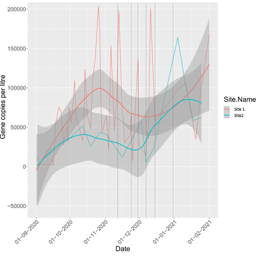

 

##### **Hospital rooms**

We visited three hospitals in Scotland in November and December 2020. Data from wastewater shows that there were similar community levels of Covid-19 infections (around 75,000 gene copies/litre found in the treatment sites closest to each hospital) surrounding the hospitals during data collection (Figure 2). Given similar infection rates, we pooled all the available data for the hospitals. For the single patient room, the total area of surfaces in each zone was assumed to be 10,000 cm2. We estimated the room volume and air exchange rate using a uniform distribution, with a minimum of 47 and a maximum of 50 m3 for the volume and 2.5 (minimum) and 3.5 (maximum) for the air changes per hour, based on the data collected in the Scottish hospitals. We assigned a random air speed between zones in the room of 3.7 metres per minute. Parameters for the other rooms are presented in the "Parameters" tab. 

##### *Figure 2: Background waste water contamination for site visits*

n.b. Using the [SEPA](https://informatics.sepa.org.uk/RNAmonitoring/) waste water contamination data from the nearest available site to the hospitals we can understand the context of the data collection in terms of infection in the community. The graph below shows that during hospital data collection (12/11/2020, 23/11/2020) at Site 1 was approximately 75,000 gene copies per litre. This was similar to the waste water contamination at Site 2 during data collection at the other hospitals on (30/11/2020, 07/12/2020, 15/12/2020).

##### **Office meeting room**

We applied the model to a meeting room in an office. The scenario was a meeting with participants being between 115 and 125 minutes within the room. The room characteristics were measured as part of the [PROTECT](https://sites.manchester.ac.uk/covid19-national-project/research-themes/approaches-to-evaluate-environmental-transmission-mechanisms-and-controls/) project. The height of the room was 2.75 m, the near-field was defined as 2m2 around the infected person. The area of surfaces that could be touched was 50% an individual’s own desk and the two nearest desks, which equalled 22,500 cm2. Based on studies conducted in offices, the hand to surface touches were modified to a mode of 479 (370 to 720) contacts/hour [45]; and hand to face to mu of 8.58 and size of 0.54 (on average 8 contacts per hour).  A room volume of 110-112m3 was used with room ventilation of 3.2-3.6 ACHs. We replaced the upper bounds of the adjustment for virus deposited on mucous membranes reaching the receptors in the lung to 0.1 (instead of 0.01 previously). We specified zero coughs for this model and unknown viral load in saliva and emissions via coughing (i.e. full range of the values given above). The exhaled emissions for this scenario was on average 1,098 RNA per minute. 

