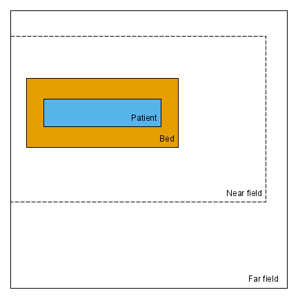
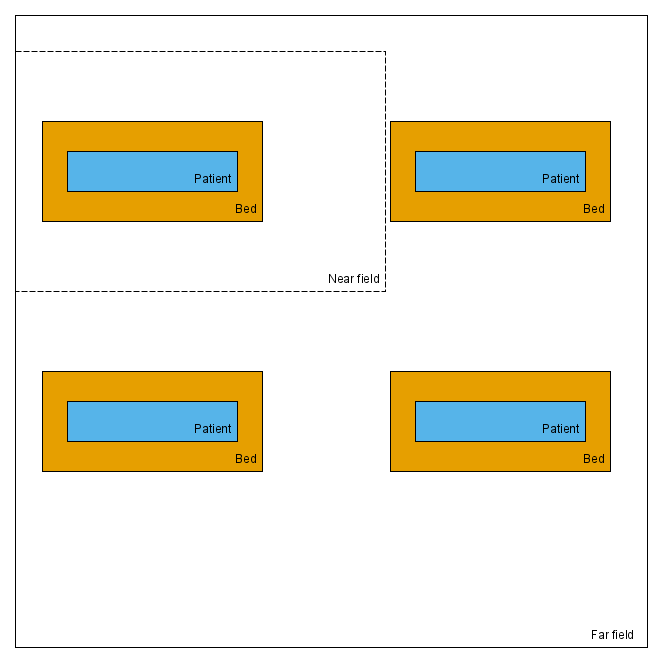

 

##### **Single patient hospital room**

A single patient room in a covid assessment ward, visited on the 15th of December 2020. For the single patient room, the area of surfaces in each zone was assumed to be 1000cm2. We estimated the room volume and air exchange rate using a uniform distribution, with a minimum of 47 and a maximum of 50 m3 for the volume and 2.5 (minimum) and 3.5 (maximum) for the air changes per hour, based on the data collected in the Scottish hospitals. We assumed that the room height was 3m and estimated the random air speed between zones as 3.7m/s. We used estimates of a single care shift for time spent in the room (triangular; mode=13, minimum=1, maximum=17). Observational data on surface touches was used to parameterise touches in the near (triangular; mode=124, minimum=0, maximum=411) and far field (triangular; mode=25, minimum=0, maximum=360), and percentage of time spent in the far field (30-40% of time). The hand to face touches were estimated from a negative binomial distribution (size=0.44, mu=0.52). 

##### **Multi patient hospital room**

A multi patient room in a covid assessment ward, visited on the 30th of November and the 7th of December 2020. For the multi-patient room, the area of surfaces in each zone was assumed to be 2000cm2. We estimated the room volume and air exchange rate using a uniform distribution, with a minimum of 119 and a maximum of 121 m3 for the volume and 1.5 (minimum) and 2.5 (maximum) for the air changes per hour, based on the data collected in the Scottish hospitals. We assumed that the room height was 3m and estimated the random air speed between zones as 3.7m/s. We used estimates of a single care shift for time spent in the room (triangular; mode=13, minimum=1, maximum=17). Observational data on surface touches was used to parameterise touches in the near (triangular; mode=124, minimum=0, maximum=411) and far field (triangular; mode=25, minimum=0, maximum=360), and percentage of time spent in the far field (30-40% of time). The hand to face touches were estimated from a negative binomial distribution (size=0.44, mu=0.52). 

